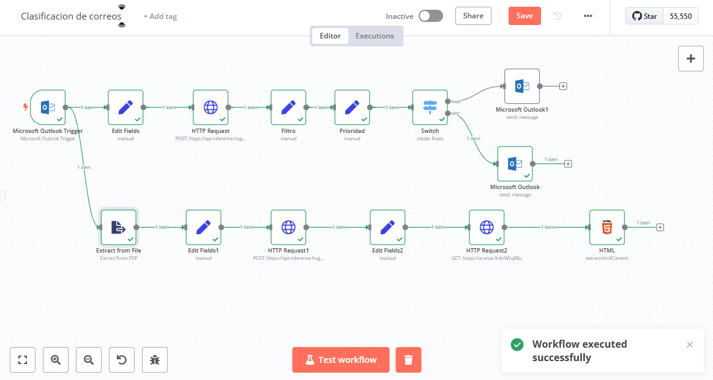

# 📧AIRIS soluciones- Automatización de Correos prueba  usando n8n

Este proyecto automatiza la clasificación de correos electrónicos, extracción de adjuntos y scraping de datos web utilizando `n8n`.

## 🚀 Descripción del Proyecto
El flujo de `n8n` ejecuta las siguientes tareas:
1. **Lectura de correos en Microsoft Outlook**.
2. **Clasificación de correos** usando [DistilBERT de Hugging Face](https://api-inference.huggingface.co/models/distilbert/distilbert-base-uncased-finetuned-sst-2-english).
   - Correos de **alta importancia** → Notificación a `persona_A`.
   - Correos de **baja importancia** → Notificación a `persona_B`.
3. **Extracción de adjuntos** (PDFs) desde el correo.
4. **Extracción de información relevante** de PDFs con [DistilBERT SQuAD](https://api-inference.huggingface.co/models/distilbert/distilbert-base-uncased-distilled-squad).
5. **Scraping de datos web** para obtener el precio de un producto.

## 📌 Tecnologías Utilizadas
- `n8n`
- `Microsoft Outlook API`
- `Hugging Face API`
- `HTTP Request`
- `Web Scraping`

## 📷 Diagrama de Arquitectura


## 📄 Instalación y Uso
1. Clonar este repositorio:
   ```bash
   git clone https://github.com/tu-usuario/n8n-automatizacion-correos.git
